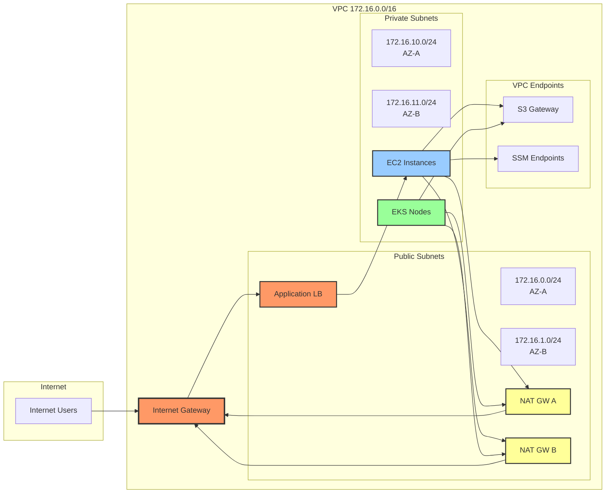
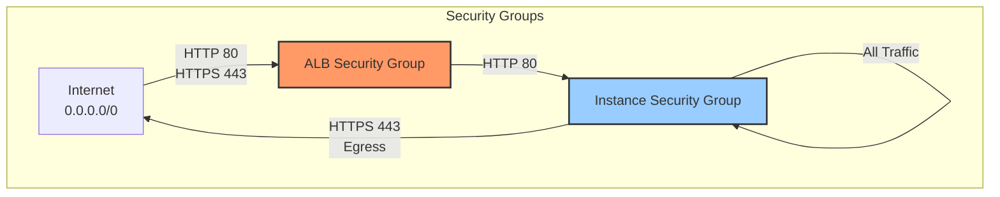
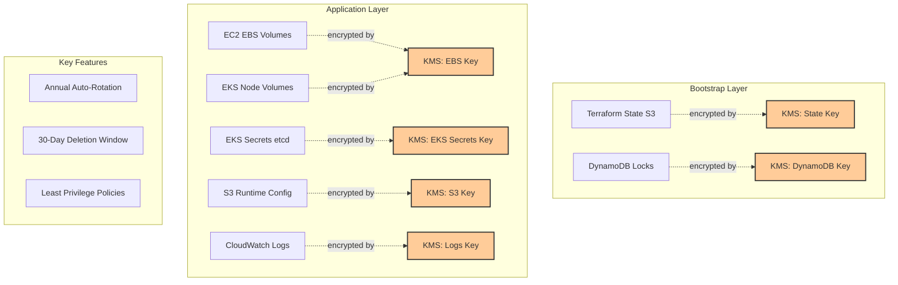
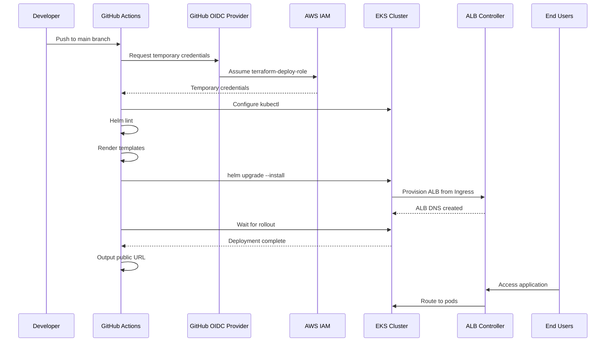
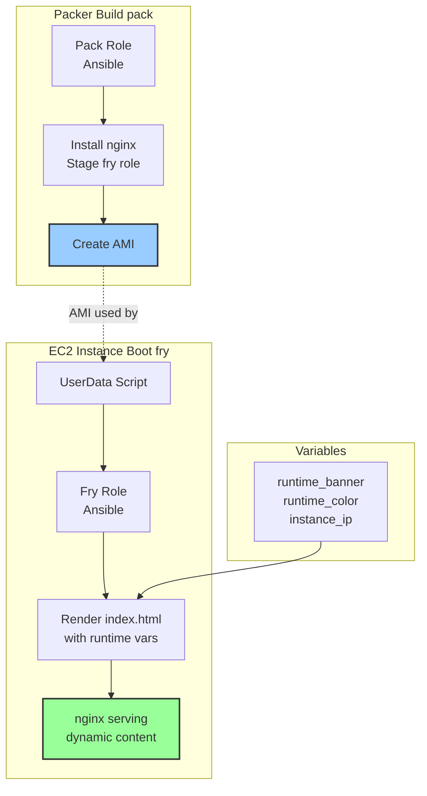
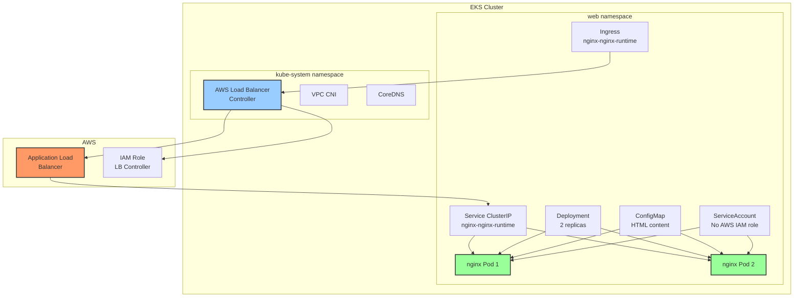

# AWS IaC

## Project Overview

The repository is structured to solve two main challenges:

1.  **A Small EC2 App**: Deploys a fault-tolerant Nginx web server on an EC2 Auto Scaling group using a custom AMI. This demonstrates the "Pack/Fry" pattern, where a base image is "packed" with software (Packer & Ansible) and configured at launch time ("fried") with dynamic data (Terraform & User Data).
2.  **Deploying an Application**: Deploys a containerized Nginx application to an EKS cluster using a Helm chart. The deployment is fully automated via a GitHub Actions workflow that authenticates with AWS using OIDC.

## Prerequisites

**Required Tools:**
- [Terraform](https://developer.hashicorp.com/terraform)
- [Terragrunt](https://terragrunt.gruntwork.io)
- [Packer](https://developer.hashicorp.com/packer)
- [Ansible](https://www.ansible.com)
- [AWS CLI v2](https://aws.amazon.com/cli/)
- [Helm](https://helm.sh)
- [kubectl](https://kubernetes.io/docs/tasks/tools/)

**AWS Permissions:**
- AdministratorAccess for bootstrap (one-time)
- AssumeRole permission for terraform-deploy-role (ongoing)

## Quick Start

```bash
# 1. Configure AWS account details
cp root.hcl.example root.hcl
# Edit root.hcl with your account_id, region, github_org/repo

# 2. Bootstrap (S3 backend, IAM roles, KMS keys, OIDC provider)
# Bootstrap is fully idempotent - auto-detects and adopts orphaned resources
cd bootstrap
terragrunt apply -auto-approve
cd ..

# 3. Build AMI (Amazon Linux 2023 with nginx)
cd packer
packer init .
packer build -var "region=us-west-2" -var "build_suffix=$(git rev-parse --short HEAD)" main.pkr.hcl
# Save the AMI ID from output
cd ..

# 4. Deploy infrastructure (VPC, EC2, EKS with KMS encryption)
cd live/staging
cp terragrunt.hcl.example terragrunt.hcl
# Edit terragrunt.hcl and set ami_id from step 3
terragrunt apply
cd ../..

# 5. Configure GitHub Actions variables
# Get values from terragrunt output
terragrunt output -raw eks_cluster_name  # e.g., a-small-ec2-app-staging-eks-1-34
echo "arn:aws:iam::$(terragrunt output -raw caller_account_id):role/terraform-deploy-role"
# Set these in GitHub: Settings > Secrets and variables > Actions > Variables
# - EKS_CLUSTER_NAME
# - TERRAFORM_DEPLOY_ROLE_ARN

# 6. Get public URLs
echo -e "\nEC2 App: http://$(cd live/staging && terragrunt output -raw alb_dns_name 2>/dev/null)"
echo -e "\nEKS App: http://$(kubectl get ingress -n web nginx-nginx-runtime -o jsonpath='{.status.loadBalancer.ingress[0].hostname}')"
```

## Day-2 Operations

### EC2 Application Updates

**Update AMI and Rolling Instance Refresh:**

```bash
# 1. Build new AMI with latest code
cd packer
packer build -var "region=us-west-2" -var "build_suffix=$(git rev-parse --short HEAD)" main.pkr.hcl
# Note the AMI ID from output (e.g., ami-0abc123def456789)
cd ..

# 2. Update infrastructure with new AMI
cd live/staging
# Edit terragrunt.hcl and update ami_id variable
terragrunt apply
cd ../..

# 3. Trigger rolling instance refresh
aws autoscaling start-instance-refresh \
  --auto-scaling-group-name a-small-ec2-app-staging-asg \
  --preferences '{"MinHealthyPercentage":50,"InstanceWarmup":60}'

# 4. Monitor refresh status
aws autoscaling describe-instance-refreshes \
  --auto-scaling-group-name a-small-ec2-app-staging-asg \
  --query 'InstanceRefreshes[0].{Status:Status,PercentageComplete:PercentageComplete,StartTime:StartTime}'

# 5. Verify new instances are running
aws ec2 describe-instances \
  --filters "Name=tag:aws:autoscaling:groupName,Values=a-small-ec2-app-staging-asg" \
            "Name=instance-state-name,Values=running" \
  --query 'Reservations[*].Instances[*].[InstanceId,ImageId,LaunchTime]' \
  --output table
```

**Infrastructure Changes Only:**

```bash
cd live/staging
terragrunt apply
# No instance refresh needed - Terraform will update resources directly
```

### EKS Application Updates

**Deploy via GitHub Actions (Recommended):**

```bash
# 1. Make changes to helm chart (charts/nginx-runtime/)
# 2. Commit and push to main branch
git add .
git commit -m "Update nginx configuration"
git push origin main

# 3. GitHub Actions automatically deploys Helm chart to EKS
# Monitor at: https://github.com/<your-org>/<your-repo>/actions

# 4. Verify deployment
kubectl get pods -n web
kubectl get ingress -n web nginx-nginx-runtime
```

## Architecture Overview

### Network Architecture

**VPC Design:**
- Supernet: 172.16.0.0/16
- Two Availability Zones for high availability
- Four subnets per AZ:
  - Public subnets (172.16.0.0/24, 172.16.1.0/24)
  - Private subnets (172.16.10.0/24, 172.16.11.0/24)
- NAT Gateway per AZ for private subnet egress
- Internet Gateway for public subnet ingress/egress
- VPC Endpoints:
  - S3 Gateway Endpoint (no data transfer charges)
  - SSM Interface Endpoints (ec2messages, ssm, ssmmessages)

### EC2 Application Architecture

**Compute Layer:**
- Autoscaling Group: min 2, desired 2, max 4 instances
- Launch Template with KMS-encrypted EBS (gp3, 10GB)
- IMDSv2 enforcement for enhanced security
- Private subnet placement (no direct internet access)

**Load Balancing:**
- Internet-facing Application Load Balancer
- HTTP listener (port 80) with optional HTTPS (port 443)
- Target group with health checks (path: /)
- Cross-zone load balancing enabled

**Security:**
- ALB Security Group: Allow 0.0.0.0/0 on ports 80/443
- Instance Security Group: Allows HTTP traffic (port 80) exclusively from the ALB. No other inbound ports are open.
- Administrative Access: Managed via AWS SSM Session Manager, which removes the need for SSH keys and open SSH ports.

### EKS Application Architecture

**Cluster Configuration:**
- EKS 1.34 managed control plane
- Managed node group in private subnets
- KMS-encrypted Kubernetes secrets (etcd encryption)
- AWS VPC CNI for pod networking

**Kubernetes Resources:**
- Deployment: 2 nginx replicas
- Service: ClusterIP type (internal only)
- Ingress: AWS ALB controller provisions internet-facing ALB
- ConfigMap: Custom HTML content
- ServiceAccount: Standard Kubernetes ServiceAccount (no AWS IAM role)

### Encryption Architecture

**KMS Keys:**
- S3 encryption key (bootstrap state bucket, runtime config)
- EBS encryption key (EC2 volumes, EKS node volumes, AMI snapshots)
- EKS secrets encryption key (Kubernetes etcd encryption)
- DynamoDB encryption key (state lock table)
- CloudWatch Logs encryption key (EKS control plane logs)

All KMS keys have:
- Automatic rotation enabled (annual)
- 30-day deletion window
- Comprehensive key policies with least privilege
- Service principal and role-based access


# Architecture Diagrams

## Overall Infrastructure

```mermaid
graph TB
    subgraph "AWS Cloud - us-west-2"
        subgraph "VPC 172.16.0.0/16"
            subgraph "AZ-A us-west-2a"
                PubA[Public Subnet<br/>172.16.0.0/24]
                PrivA[Private Subnet<br/>172.16.10.0/24]
                NATA[NAT Gateway A]
            end

            subgraph "AZ-B us-west-2b"
                PubB[Public Subnet<br/>172.16.1.0/24]
                PrivB[Private Subnet<br/>172.16.11.0/24]
                NATB[NAT Gateway B]
            end

            IGW[Internet Gateway]

            subgraph "EC2 Application"
                ALB[Application Load Balancer]
                ASG[Auto Scaling Group<br/>2-4 instances]
                EC2A[EC2 Instance 1<br/>Amazon Linux 2023]
                EC2B[EC2 Instance 2<br/>Amazon Linux 2023]
            end

            subgraph "EKS Cluster 1.34"
                EKS_CP[EKS Control Plane]
                EKS_NG[Managed Node Group]
                POD1[nginx Pod 1]
                POD2[nginx Pod 2]
                EKS_ALB[EKS ALB<br/>via ALB Controller]
            end

            subgraph "VPC Endpoints"
                S3EP[S3 Gateway Endpoint]
                SSMEP[SSM Interface Endpoints]
            end
        end

        subgraph "KMS Encryption"
            KMS_S3[S3 Key]
            KMS_EBS[EBS Key]
            KMS_EKS[EKS Secrets Key]
            KMS_DDB[DynamoDB Key]
            KMS_LOGS[CloudWatch Logs Key]
        end

        subgraph "Storage & State"
            S3[S3 Bucket<br/>Terraform State]
            DDB[DynamoDB Table<br/>State Locks]
            S3_RT[S3 Bucket<br/>Runtime Config]
        end

        subgraph "IAM"
            DEPLOY_ROLE[terraform-deploy-role]
            INSTANCE_ROLE[EC2 Instance Profile]
            EKS_NODE_ROLE[EKS Node Role]
            LBC_ROLE[Load Balancer Controller Role]
        end
    end

    subgraph "GitHub"
        GH_ACTIONS[GitHub Actions<br/>OIDC]
        GH_OIDC[GitHub OIDC Provider]
    end

    subgraph "Internet"
        USER[Users]
    end

    %% Connections
    USER --> IGW
    IGW --> ALB
    IGW --> EKS_ALB
    ALB --> EC2A
    ALB --> EC2B
    EKS_ALB --> POD1
    EKS_ALB --> POD2

    PubA --> NATA
    PubB --> NATB
    NATA --> PrivA
    NATB --> PrivB

    EC2A --> PrivA
    EC2B --> PrivB
    POD1 --> PrivA
    POD2 --> PrivB

    ASG --> EC2A
    ASG --> EC2B
    EKS_NG --> POD1
    EKS_NG --> POD2

    EC2A -.encrypted.-> KMS_EBS
    EC2B -.encrypted.-> KMS_EBS
    EKS_CP -.encrypted.-> KMS_EKS
    S3 -.encrypted.-> KMS_S3
    S3_RT -.encrypted.-> KMS_S3
    DDB -.encrypted.-> KMS_DDB

    GH_ACTIONS --> GH_OIDC
    GH_OIDC --> DEPLOY_ROLE

    EC2A --> INSTANCE_ROLE
    EC2B --> INSTANCE_ROLE
    POD1 --> EKS_NODE_ROLE
    POD2 --> EKS_NODE_ROLE
    EKS_ALB --> LBC_ROLE

    style ALB fill:#f96,stroke:#333,stroke-width:2px
    style EKS_ALB fill:#f96,stroke:#333,stroke-width:2px
    style EC2A fill:#9cf,stroke:#333,stroke-width:2px
    style EC2B fill:#9cf,stroke:#333,stroke-width:2px
    style POD1 fill:#9f9,stroke:#333,stroke-width:2px
    style POD2 fill:#9f9,stroke:#333,stroke-width:2px
    style KMS_S3 fill:#fc9,stroke:#333,stroke-width:2px
    style KMS_EBS fill:#fc9,stroke:#333,stroke-width:2px
    style KMS_EKS fill:#fc9,stroke:#333,stroke-width:2px
```



## Network Architecture



## Security Groups



## KMS Encryption Architecture



## CI/CD Pipeline



## Deployment Flow

```mermaid
graph LR
    subgraph "Step 1: Bootstrap"
        B1[Configure root.hcl]
        B2[terragrunt apply]
        B3[IAM roles, KMS keys<br/>S3 backend, OIDC]
    end

    subgraph "Step 2: Build AMI"
        P1[packer init]
        P2[packer build]
        P3[AMI with nginx<br/>+ Ansible roles]
    end

    subgraph "Step 3: Deploy Infra"
        T1[Edit terragrunt.hcl<br/>with AMI ID]
        T2[terragrunt apply]
        T3[VPC + EC2 + EKS<br/>+ KMS + IAM + LBC]
    end

    subgraph "Step 4: Setup GitHub"
        G1[Configure GitHub<br/>variables]
        G2[EKS_CLUSTER_NAME<br/>TERRAFORM_DEPLOY_ROLE_ARN]
    end

    subgraph "Step 5: Deploy via CI/CD"
        A1[Push to main branch]
        A2[GitHub Actions<br/>deploys Helm chart]
        A3[Application live]
    end

    B1 --> B2 --> B3
    B3 --> P1
    P1 --> P2 --> P3
    P3 --> T1
    T1 --> T2 --> T3
    T3 --> G1
    G1 --> G2
    G2 --> A1
    A1 --> A2 --> A3

    style B3 fill:#9f9,stroke:#333,stroke-width:2px
    style P3 fill:#9f9,stroke:#333,stroke-width:2px
    style T3 fill:#9f9,stroke:#333,stroke-width:2px
    style A3 fill:#9f9,stroke:#333,stroke-width:2px
```



## Pack/Fry Pattern (EC2 Deployment)



## EKS Application Architecture



---

## Legend

- 🔵 Blue: EC2 Instances
- 🟢 Green: Kubernetes Pods
- 🔴 Red: Load Balancers
- 🟡 Yellow: NAT Gateways
- 🟠 Orange: KMS Keys
- Dashed lines: Encryption relationships
- Solid lines: Network/data flow
